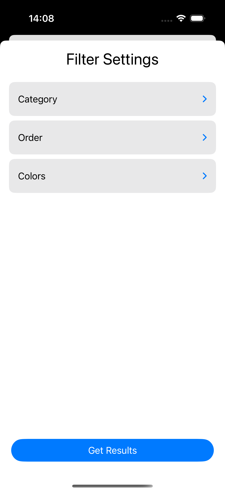

# Photo Gallery iOS Application

A simple and clean-coded photo gallery iOS application. This project is developed to demonstrate the basic functionalities of a photo gallery in the iOS environment.

## Features

- **Clean Interface:** User-friendly, simple, and modern design.
- **Grid Layout:** Photos are displayed in a grid layout.
- **Full Screen View:** Tapping on a photo provides a detailed, full screen view.
- **Flexible Extensibility:** Additional features can be integrated as needed.

## Technologies Used

- **SwiftUI:** Used to build the modern and declarative user interface of the application.
- **URLSession:** Built-in networking library used for fetching data from the internet and downloading photos.
- **Xcode & iOS SDK:** The development environment and components of the iOS platform.
- **Swift:** The programming language used for the project.

## Usage

- When the application is launched, the photos in the gallery are presented in a grid layout.
- Tapping on any photo transitions to a detailed, full screen view.
- The project is developed to showcase the fundamental functionalities of a photo gallery, with the possibility to add more features as needed.

## Screenshots

Below are some screenshots of the application, displayed in a column layout:

  
  
  

